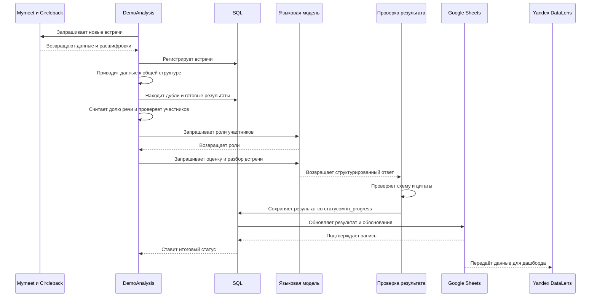
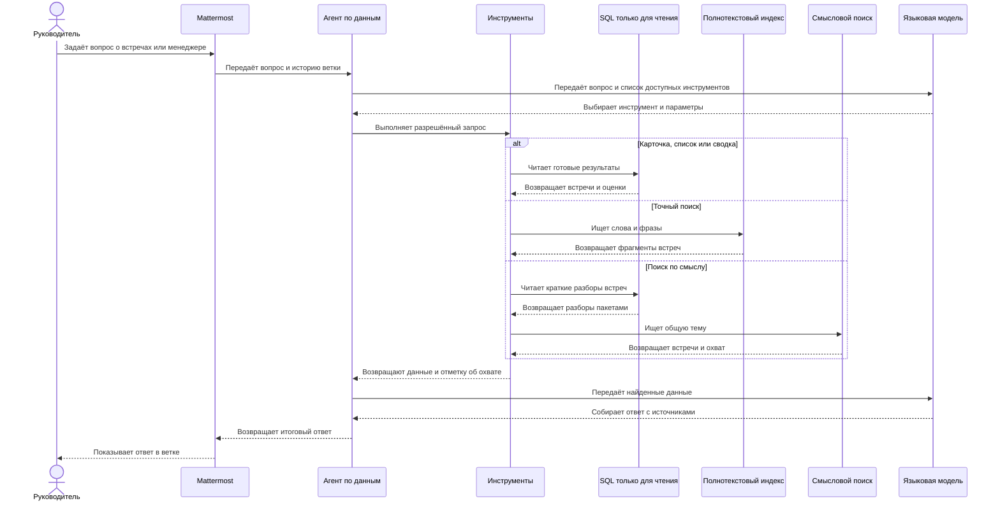

# DemoAnalysis. Анализ встреч и поиск инсайтов

`Кейс` · `Код закрыт`

[Вернуться к списку проектов](../README.md)

## Задача

Записи встреч приходят из Mymeet и Circleback. Руководителю отдела продаж нужен не архив расшифровок, а понятная картина по каждой встрече и по команде в целом.

DemoAnalysis собирает новые встречи, удаляет дубли, оценивает разговор по заданным критериям и сохраняет результат в Google Sheets. Поверх этих данных работает агент в Mattermost. Он находит встречи, сравнивает результаты менеджеров и помогает увидеть повторяющиеся боли, вопросы и возражения клиентов.

Главное требование проекта состоит в проверяемости результата. Ответ модели проходит проверку до публикации. Система проверяет схему, бинарные оценки и дословные цитаты. Фактический пересказ и впечатление модели хранятся отдельно. Каждый этап сохраняется в SQL, поэтому работа продолжается после сбоя без повторной оплаты уже готового анализа.

## Весь пайплайн

Обработка состоит из шести фаз. Каждая фаза решает одну задачу и оставляет понятный статус в базе.

### 1. Регистрация

Система постранично запрашивает встречи из двух источников. Для каждого источника хранится своя точка продолжения. Временный сбой одного сервиса не мешает забрать данные из второго. Ошибка авторизации останавливает прогон.

Новые встречи проходят фильтр по дате, названию и исключающим словам. После этого они регистрируются в SQL со статусом `new`.

### 2. Ручной отбор

Отдельный лист Google Sheets принимает ссылку или идентификатор встречи. Такая запись проходит в обработку даже тогда, когда не подходит под обычные фильтры. Результат поиска отражается в том же листе.

### 3. Получение расшифровки

Для Mymeet система проверяет состояние встречи и пытается скачать исходный JSON. Статус внешнего сервиса не считается единственным источником истины. Встреча может быть помечена как новая, хотя расшифровка уже готова.

Данные Circleback загружаются пакетами. Ошибка одного пакета учитывается отдельно и не стирает уже полученные встречи. Исходные ответы сохраняются локально, а данные обоих сервисов приводятся к одной внутренней структуре.

### 4. Поиск дублей

Дубли определяются по нормализованному названию и времени начала. Это работает и для встреч из разных источников. Основной становится запись с расшифровкой. Если расшифровки есть у обеих записей, выбирается более длинная встреча.

Уже оценённая встреча не отправляется в модель второй раз. Остальные идентификаторы связываются с готовым результатом.

### 5. Оценка

Сначала работают проверки в коде. Они отсеивают пустые и слишком длинные расшифровки, неподходящий язык и встречи без нужного менеджера.

Доля речи считается по таймингам реплик. Если тайминги неполные, система использует длительность между началами соседних реплик, а затем количество слов.

Короткий запрос к модели определяет роль каждого участника. Возможны роли менеджера, клиента и другого участника. Если клиентская сторона не найдена, дополнительная проверка анализирует конец разговора. Встреча без клиента не идёт в дорогую основную оценку.

Основной запрос оценивает 11 критериев. Ещё один критерий, доля речи клиента от 40 до 60 процентов, считается кодом. В итоге встреча получает 12 оценок в двух группах. Первая группа показывает признаки успешного демо. Вторая показывает качество работы менеджера.

В том же ответе модель собирает вопросы клиента, его боль и краткий разбор встречи. Разбор содержит контекст клиента, показанную часть продукта, возражения, договорённости и ключевые моменты. Факты хранятся отдельно от общего впечатления модели.

### 6. Публикация

Проверенный результат сначала записывается в SQL со статусом `in_progress`. Затем система обновляет строку встречи в Google Sheets и отдельно сохраняет обоснования оценок.

Только подтверждённая запись в таблицу меняет статус на `ok` или `needs_review`. Если таблица временно недоступна, следующий запуск повторяет публикацию, а не платный анализ.

Yandex DataLens строит рабочий дашборд поверх листа с результатами. Дашборд находится за пределами кода DemoAnalysis.

## Как проверяется результат модели

Основные оценки приходят по строгой схеме. Для каждого критерия обязательны значение `0` или `1` и причина. Цитата ожидается, но её отсутствие не отбрасывает весь ответ. Такой результат получает статус `needs_review`.

Цитаты проверяются по исходной расшифровке. Перед сравнением система выравнивает регистр, буквы `е` и `ё`, кавычки, тире и знаки препинания. Составная цитата проверяется по частям. Нечёткое сравнение помогает пережить небольшие различия в расшифровке, но не пропускает фразу, которой в разговоре не было.

Ошибочная цитата у основного критерия переводит результат в `needs_review`. Дополнительные вопросы и ключевые моменты с неподтверждёнными цитатами удаляются из ответа. Это не запускает повторно всю платную оценку.

## Агент по данным

Агент работает в Mattermost и отвечает на вопросы по уже обработанным встречам. Это не обычный поиск по словам. Модель сама выбирает подходящий инструмент, получает данные, при необходимости делает следующий запрос и только потом собирает ответ.

Контекст диалога сохраняется внутри ветки Mattermost. Поэтому после вопроса о менеджере можно уточнить период или попросить показать конкретную встречу без повторения всей формулировки.

Аналитические инструменты агента работают только на чтение и сами не меняют оценки. Его задача состоит в том, чтобы найти нужные данные, связать факты из нескольких встреч и понятно объяснить вывод. Отдельные операторские команды могут запустить пайплайн или повторную оценку встречи.

### Какие данные доступны агенту

Агент использует несколько специализированных инструментов.

- Список встреч с фильтрами по менеджеру, периоду, названию и статусу.
- Карточка встречи с оценками, обоснованиями, долей речи, вопросами клиента, болью, кратким разбором и ссылкой.
- Сводка по менеджеру со средними оценками и самыми слабыми критериями.
- Чтение расшифровки частями для проверки контекста конкретной реплики.
- Точный поиск по расшифровкам и разборам встреч.
- Поиск по смыслу для тем, которые могут быть сформулированы разными словами.
- Произвольный запрос только на чтение для нестандартного среза данных.

Каждый вызов открывает базу заново в режиме только для чтения. Благодаря этому агент видит свежие результаты пайплайна и не держит долгую транзакцию.

### Как агент находит инсайты

Для вопроса об одной встрече агент получает готовую карточку. В ней уже разделены оценки, подтверждающие цитаты, фактический разбор и впечатление модели.

Для вопроса о работе менеджера агент собирает все подходящие встречи за период. Сводка считает средний балл по двум группам, среднюю долю речи и частоту выполнения каждого критерия. Критерии с результатом не выше 50 процентов выделяются как слабые места.

Точный поиск используется для конкретных слов, названий и формулировок. Он построен на полнотекстовом индексе и возвращает фрагменты с контекстом. Индекс обновляется перед поиском и подхватывает новые или изменённые встречи.

Поиск по смыслу помогает найти общую тему. Например, клиенты могут по-разному говорить о ручной работе, долгом согласовании или сложной интеграции. Модель проверяет краткие разборы встреч пакетами и возвращает подходящие идентификаторы. После этого агент может открыть нужные карточки и связать находки в общий вывод.

Такой пайплайн позволяет отвечать на вопросы о повторяющихся болях клиентов, частых возражениях, качестве следующего шага, вовлечённости клиентов и различиях между менеджерами. В ответе сохраняется связь с исходными встречами, датами и менеджерами.

### Полнота ответа

Постраничный список и смысловой поиск возвращают не только найденные строки, но и сведения об охвате. В них указано, сколько встреч просмотрено, есть ли следующая страница, были ли пропущены записи без разбора и завершились ли все пакеты без ошибок.

Если смысловой поиск просмотрел только часть данных, агент сообщает об этом в ответе. Вывод об отсутствии информации допустим только после полного просмотра выбранного набора встреч.

Фактическая часть краткого разбора отделена от впечатления модели. Агент учитывает это различие и не выдаёт мнение модели за реплику участника встречи.

### Ограничения доступа и запросов

К боту допускаются только разрешённые пользователи и команды Mattermost. Обычные пользователи получают инструменты чтения. Операторские действия доступны отдельной роли и повторно проверяются при каждом вызове.

Произвольные запросы к SQL защищены на нескольких уровнях. Допускается один запрос `SELECT` или `WITH SELECT`. Встроенный механизм SQL запрещает запись, изменение схемы, подключение других баз и служебные команды. Время выполнения, число строк, размер ответа и длина отдельных значений ограничены.

Расшифровки, результаты инструментов и сообщения из ветки считаются данными, а не командами для агента. Это снижает риск выполнения инструкции, случайно попавшей в текст встречи.

Агент учитывает число токенов, использование кеша и стоимость запросов. При достижении лимита шагов он прекращает вызовы инструментов и формирует итог из уже собранных данных.

## Повторные запуски и ошибки

SQL хранит состояние каждой встречи и результат оценки. После остановки система продолжает с последнего подтверждённого этапа. Записанный результат не оценивается повторно только из-за ошибки Google Sheets.

Файлы блокировки не дают двум процессам одновременно запускать один цикл обработки. Старый брошенный файл снимается по заданному сроку.

Временные ошибки внешних сервисов повторяются с задержкой. Ошибки с понятной постоянной причиной получают отдельный статус и не создают бесконечный цикл.

Перед записью в Google Sheets строки с первым символом `=`, `+`, `-` или `@` экранируются. Заголовки колонок сравниваются с сохранённой схемой. Изменения шапки показываются до записи. Критичные ошибки останавливают прогон, а отсутствующие необязательные колонки попадают в предупреждение.

## Проверка качества

В репозитории есть 51 тестовый файл на `pytest`. GitHub Actions запускает тесты при изменениях. Они работают без рабочих ключей и сетевого доступа.

Тесты используют ответы с формой настоящих API, но с вымышленным содержимым. Языковая модель, Google Sheets и внешние сервисы заменяются управляемыми тестовыми версиями.

Проверки покрывают загрузку из двух источников, дубли, ручной отбор, расчёт доли речи, роли участников, валидацию ответа модели, поиск цитат и продолжение работы после сбоя. Отдельные наборы тестов проверяют агента, маршрутизацию сообщений, права доступа, полнотекстовый поиск, смысловой поиск и защиту запросов к SQL.

Тесты проверяют фикстуры на рабочие адреса почты, телефоны, ссылки и служебные идентификаторы. При наличии локальной таблицы замен дополнительно проверяются имена и компании.

## Почему код закрыт

Проект работает с внутренними встречами и рабочими системами. Поэтому исходный код и реальные данные не публикуются.

В открытом доступе нет расшифровок, инструкций для модели, имён сотрудников и клиентов, идентификаторов, внутренних ссылок, стоимости запросов и бизнес-показателей.
