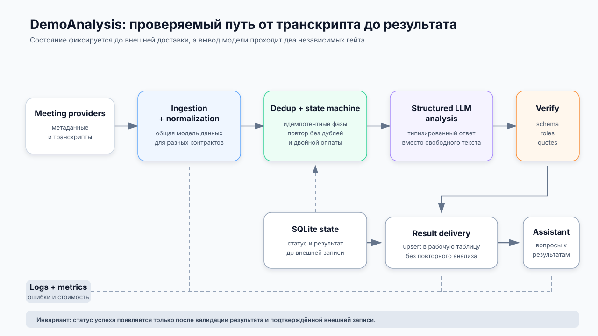

# DemoAnalysis — надёжный LLM-pipeline для анализа встреч отдела продаж

`Case study` · `Closed source`

> Репозиторий остаётся закрытым, поскольку связан с рабочими встречами и корпоративными интеграциями. Архитектура ниже обезличена; все названия людей, компаний, рабочих пространств, таблиц, встреч, URL и тексты транскриптов исключены.

[← К списку проектов](../README.md)

## Контекст и проблема

Записи и транскрипты встреч поступают из нескольких внешних систем. Ручной разбор плохо масштабируется, а свободная генерация LLM может добавить вывод, которого нет в разговоре, или привести неточную цитату. При повторном запуске также нельзя дублировать строки во внешней системе или повторно оплачивать уже выполненный анализ.

Нужен был pipeline, который устойчиво получает встречи, нормализует разные форматы, сохраняет прогресс, получает структурированную оценку, проверяет доказательства по исходному транскрипту и доставляет результат в рабочие интерфейсы.

## Решение

Процесс построен как идемпотентная state machine. Каждая встреча проходит последовательные фазы регистрации, получения данных, дедупликации, анализа, валидации и записи. SQLite хранит промежуточное состояние до внешней доставки, поэтому повторный прогон продолжает работу с безопасной точки и не создаёт второй результат.

| Контур | Ответственность |
|---|---|
| Meeting providers | Отдают метаданные встреч и транскрипты через разные API/CLI-контракты |
| Ingestion и normalization | Приводят ответы источников к общей внутренней модели |
| Dedup и state machine | Определяют следующий шаг, схлопывают повторы и сохраняют прогресс |
| Structured LLM analysis | Возвращает результат по заданной схеме, а не свободный текст |
| Schema и quote verification | Проверяет структуру и наличие приведённых цитат в транскрипте |
| SQLite state | Хранит статусы и результат до подтверждённой внешней записи |
| Result delivery | Обновляет рабочую таблицу без создания дублей |
| Assistant interface | Даёт контролируемый доступ к уже сохранённым результатам |
| Logs и metrics | Показывают состояние фаз, ошибки интеграций и использование модели |

## State machine и идемпотентность

Один цикл выполняет шесть фаз:

1. **Register** — находит новые встречи и регистрирует их без анализа.
2. **Manual** — принимает адресно выбранную встречу через контролируемый рабочий интерфейс.
3. **Resolve** — получает транскрипт и нормализует ответ конкретного источника.
4. **Deduplicate** — объединяет повторные записи по нормализованному ключу.
5. **Evaluate** — применяет дешёвые проверки, выполняет структурированный LLM-анализ, валидирует схему, роли и цитаты, затем сохраняет результат в SQLite.
6. **Write** — делает upsert результата; финальный статус появляется только после подтверждённой записи.

Результат LLM сначала сохраняется локально. Если внешняя таблица временно недоступна, следующий запуск повторяет только доставку, а не платный анализ. Lock-файлы не позволяют двум циклам одновременно менять одно состояние.

## Structured output и проверка цитат

LLM возвращает типизированный объект с ожидаемыми полями. Ответ, который не проходит schema validation, не попадает в рабочий результат. Для каждого утверждения, требующего доказательства, система нормализует цитату и ищет её фрагменты в исходном транскрипте. Неподтверждённая цитата отклоняется или переводит результат в режим ручной проверки — модель не может объявить собственный текст первичным источником.

До дорогого анализа выполняются детерминированные гейты: длина и язык транскрипта, наличие нужных сторон разговора, соответствие разрешённой выборке и дедупликация. Это снижает лишние вызовы модели и отделяет бизнес-правила от prompt.

## Поведение при сбоях

Сбой одного источника данных изолирован от другого, если оставшийся источник может продолжить цикл. Временные ошибки API и внешней таблицы сохраняют повторяемое состояние; терминальные ошибки получают явный статус и не зацикливаются бесконечно. Некорректный ответ LLM или обрезанный JSON не записывается как успешная оценка.

Запись во внешнюю таблицу выполняется по ключу встречи. Пользовательский текст экранируется перед режимом интерпретации значений, чтобы строка из транскрипта не стала исполняемой формулой. Изменения схемы таблицы обнаруживаются до записи и отражаются в техническом отчёте цикла.

## Доставка и интерфейс вопросов

Проверенный результат поступает в рабочую таблицу, где сохраняются структурированные оценки и основания. Отдельный ассистент отвечает на вопросы только по уже обработанному набору и учитывает границы доступной выборки. Он не получает право незаметно переоценивать исходный транскрипт или обходить контроль доступа.

## Проверка качества

В закрытом репозитории присутствуют офлайн-тесты на `pytest` и workflow непрерывной интеграции. Внешние сервисы заменены fake/mock-реализациями, а fixtures используют структуру реальных API при синтетическом содержимом.

Проверяются:

- парсеры и нормализация ответов разных источников;
- дедупликация и идемпотентность повторного прогона;
- переходы state machine и восстановление после обрыва;
- schema validation и обработка повреждённого ответа LLM;
- проверка цитат по транскрипту;
- безопасная запись и экранирование формул;
- ошибки API, LLM, внешней таблицы и интерфейса ассистента;
- гигиена fixtures: отсутствие реальных ФИО, компаний, email и ссылок.

Конкретные бизнес-метрики и содержимое рабочих встреч не публикуются. Case study подтверждает архитектурные свойства, но не приписывает системе проценты эффективности, которых нельзя независимо проверить.

## Ограничения

- Качество анализа ограничено качеством транскрипта и разметки спикеров.
- Верификация подтверждает присутствие цитаты, но сама по себе не доказывает корректность всей интерпретации.
- Изменение контрактов внешних API требует обновления адаптеров и fixtures.
- Редкие неоднозначные случаи переводятся на ручную проверку, а не скрываются за успешным статусом.
- Локальное состояние упрощает одиночный deployment, но потребует другого storage-контура при горизонтальном масштабировании.

## Следующий этап

Следующим шагом было бы вынести приёмник результатов за стабильный интерфейс, добавить формальную оценку качества на полностью синтетическом benchmark-наборе и расширить трассировку причин перехода в ручную проверку.

## Что показано публично

Опубликованы обезличенная архитектура, модель состояния, ключевые решения по надёжности и тестовая стратегия. Не публикуются транскрипты, prompts заказчика, идентификаторы встреч и рабочих пространств, названия компаний и сотрудников, внутренние URL, стоимость и неподтверждённые бизнес-метрики.
