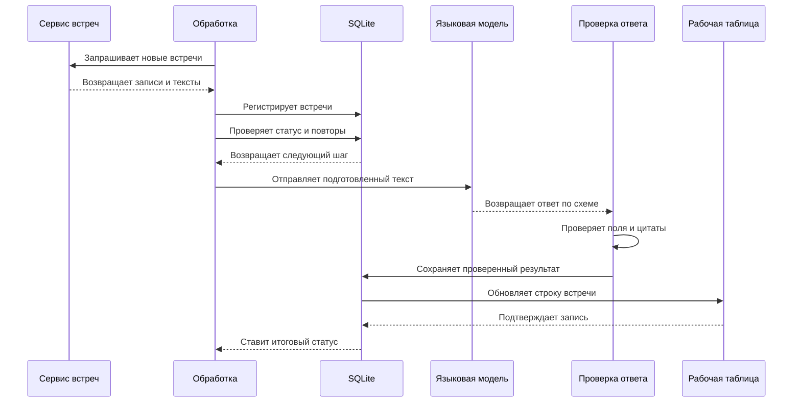

# DemoAnalysis. Анализ встреч с проверкой ответа модели

`Кейс` · `Код закрыт`

[Вернуться к списку проектов](../README.md)

## Задача

Записи встреч приходят из нескольких сервисов. Разбирать их вручную долго. Языковая модель может ускорить работу, но её ответ нельзя сразу считать верным. Она может сделать вывод, которого не было в разговоре, или привести неточную цитату.

Также важно правильно обрабатывать повторные запуски. Система не должна второй раз оплачивать уже готовый анализ или создавать одинаковые строки в рабочей таблице.

DemoAnalysis решает обе задачи. Он запоминает каждый шаг обработки и проверяет ответ модели перед сохранением.

## Как работает DemoAnalysis

Система получает список встреч и приводит данные разных сервисов к одному формату. Затем она удаляет повторы и запускает только те проверки, которые ещё не выполнены.

Модель возвращает ответ по строгой схеме. Система проверяет все поля и ищет цитаты в исходном тексте встречи. Готовый результат сначала сохраняется в локальной базе. Только после этого он отправляется в рабочую таблицу.

## Этапы обработки

У каждой встречи есть статус. Он показывает, что уже сделано и что нужно делать дальше.

1. Система находит и регистрирует новую встречу.
2. При необходимости встречу можно добавить вручную.
3. Система получает и приводит к общему виду текст разговора.
4. Повторная запись отмечается как дубль.
5. Модель анализирует встречу. Затем система проверяет ответ и сохраняет его в SQLite.
6. Результат записывается в рабочую таблицу. Только после успешной записи встреча получает итоговый статус.

## Что происходит при повторном запуске

Система читает сохранённый статус и продолжает с нужного места. Если анализ уже готов, но рабочая таблица была недоступна, повторяется только запись в таблицу. Новый платный запрос к модели не выполняется.

Два процесса не могут одновременно обрабатывать один набор встреч. Для этого используются файлы блокировки.

## Как проверяется ответ модели

Модель не пишет свободный текст. Она должна заполнить заранее заданные поля. Если поле отсутствует или имеет неверный формат, ответ не считается готовым.

Цитаты проверяются отдельно. Система приводит цитату и текст встречи к единому виду, а затем ищет совпадение. Если цитата не найдена, она не используется как подтверждение. В спорных случаях результат отправляется на ручную проверку.

Перед запросом к модели работают простые проверки. Они отсеивают пустые и слишком длинные записи, встречи без нужных участников и дубли. Это экономит время и деньги.

## Что происходит при ошибке

Ошибка одного источника не останавливает второй источник, если он может работать дальше. Временная ошибка сохраняется, и система пробует продолжить обработку при следующем запуске.

Повреждённый ответ модели не записывается как успешный. Ошибки с понятной причиной получают отдельный статус и не повторяются бесконечно.

Перед записью в рабочую таблицу текст очищается от символов, которые могут запустить формулу. Изменение колонок таблицы проверяется до записи.

## Доступ к результатам

Проверенные результаты попадают в рабочую таблицу. Отдельный помощник может отвечать на вопросы по уже обработанным данным.

Помощник видит только разрешённый набор результатов. Он не может сам изменить исходный анализ или получить доступ к закрытым данным другого пользователя.

## Проверка качества

В закрытом репозитории есть автоматические тесты на `pytest` и проверка изменений в GitHub Actions. Для тестов не нужны рабочие ключи.

Внешние сервисы и языковая модель заменяются тестовыми версиями. Примеры сохраняют форму настоящего ответа API, но содержат только вымышленные данные.

Тесты проверяют следующее.

- Чтение и приведение данных разных сервисов к одному виду.
- Поиск дублей.
- Продолжение работы после остановки.
- Повторный запуск без второго анализа.
- Проверку полей и повреждённого ответа модели.
- Поиск цитат в тексте встречи.
- Безопасную запись в таблицу.
- Ошибки внешних сервисов.
- Отсутствие реальных имён, компаний, адресов почты и ссылок в тестовых данных.

В кейсе нет процентов эффективности и других бизнес-показателей, которые нельзя подтвердить открытыми данными.

## Ограничения

- Результат зависит от качества записи и текста встречи.
- Найденная цитата подтверждает только конкретный фрагмент. Она не доказывает, что весь вывод модели верен.
- При изменении внешнего API нужно обновить код интеграции.
- Спорные случаи всё равно требуют ручной проверки.
- SQLite подходит для одного сервера. Для нескольких серверов понадобится другая база данных.

## Что можно улучшить

Следующий шаг состоит в том, чтобы собрать полностью вымышленный набор встреч для проверки качества. Также можно подробнее показывать, почему конкретный результат отправлен на ручную проверку.

## Почему код закрыт

Проект связан с рабочими встречами и внутренними системами. Поэтому исходный код и реальные данные не публикуются.

В открытом доступе нет текстов встреч, рабочих инструкций для модели, имён сотрудников и компаний, идентификаторов, внутренних ссылок, стоимости и закрытых показателей.
