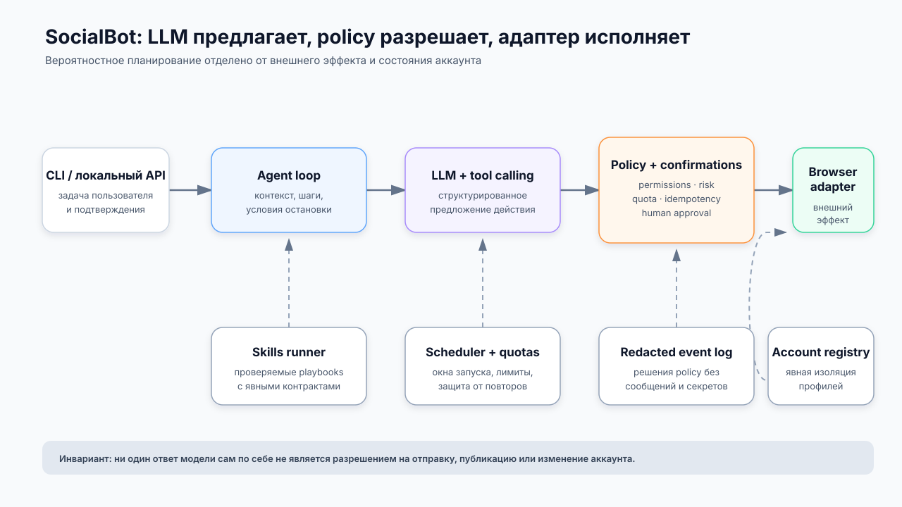

# SocialBot — безопасный браузерный агент для управляемой автоматизации социальных сетей

`Case study` · `Closed source`

> Исходный код и рабочие данные не публикуются: проект взаимодействует с пользовательскими аккаунтами и интерфейсами внешних платформ. Ниже — обезличенное описание инженерных решений без аккаунтов, сообщений, cookies, селекторов и инфраструктурных реквизитов.

[← К списку проектов](../README.md)

## Контекст и проблема

Повторяющиеся действия в социальных сетях отнимают время, но простая передача браузера LLM создаёт неприемлемый контур риска. Модель может неверно понять намерение пользователя, повторить действие, отправить неготовый текст, превысить квоту или раскрыть данные одного аккаунта в контексте другого.

Задача состояла не в том, чтобы дать модели максимальную автономность, а в том, чтобы построить управляемую автоматизацию: модель предлагает намерение, детерминированная система проверяет его, а потенциально необратимое действие остаётся под контролем человека.

## Решение

SocialBot разделяет вероятностное планирование и исполнение. LLM работает только через ограниченный набор инструментов и возвращает структурированное намерение. Policy-слой проверяет действие, аккаунт, квоту и необходимость подтверждения. Только после этого браузерный адаптер выполняет разрешённую операцию.



| Компонент | Ответственность |
|---|---|
| CLI / локальный API | Принимает задачу и показывает запросы подтверждения |
| Agent loop | Управляет шагами задачи и передаёт модели только необходимый контекст |
| LLM с tool calling | Предлагает следующее действие в рамках доступной схемы инструментов |
| Policy и confirmations | Проверяет разрешения, риск, квоты и решение пользователя |
| Browser adapter | Детерминированно выполняет разрешённые действия в браузере |
| Account registry | Изолирует конфигурацию и состояние разных аккаунтов |
| Skills runner | Запускает повторяемые playbooks с явными входами и ожидаемым результатом |
| Scheduler и quotas | Ограничивает частоту, окна запуска и повторное выполнение |
| Redacted event log | Сохраняет технический след без содержимого переписки и секретов |

## Почему модель не управляет браузером напрямую

DOM и формулировки интерфейса меняются, а ответ модели недетерминирован. Поэтому вызов LLM не равен разрешению на внешний эффект. Между решением модели и браузером находятся четыре независимых барьера:

1. **Схема инструмента** отклоняет неизвестные операции и некорректные параметры.
2. **Policy** сопоставляет действие с разрешениями текущей задачи и аккаунта.
3. **Quota и idempotency guard** ограничивают частоту и блокируют повторный запуск того же действия.
4. **Confirmation gate** требует решения человека перед необратимым или чувствительным действием.

Такой контур позволяет использовать LLM там, где нужна интерпретация контекста, не делая её единственной границей безопасности.

## Подтверждения и границы автономности

Чтение доступного контента и подготовка черновика могут быть разрешены на время конкретной задачи. Отправка, публикация, изменение профиля, переключение аккаунта и другие внешние эффекты требуют явного подтверждения. Разрешение ограничено задачей и не превращается в постоянный глобальный доступ.

Пример безопасного сценария:

```text
прочитать непрочитанные
  → подготовить черновик ответа
  → показать аккаунт, получателя и текст
  → запросить подтверждение
  → отправить один раз или отменить
```

При отмене или истечении времени подтверждения исполнитель не продолжает цепочку самостоятельно.

## Несколько аккаунтов, демон и расписание

Аккаунт является явной частью контекста выполнения, а не неявным состоянием браузера. Registry связывает задачу с конкретным профилем; browser adapter получает только выбранную конфигурацию. Это снижает риск выполнения правильного действия не в том аккаунте.

Фоновый режим и расписание используют блокировку повторного запуска. Квоты задаются отдельно от prompt и проверяются непосредственно перед действием: модель не может увеличить их текстовой инструкцией. Демон отвечает за жизненный цикл задачи, но не обходит policy и confirmation gate.

## Skills как проверяемые playbooks

Skills описывают повторяемую последовательность с явными входами, допустимыми инструментами и условиями остановки. Там, где сценарий полностью детерминирован, он может выполняться без нового вызова модели. Это уменьшает стоимость и вариативность поведения, а также позволяет тестировать playbook отдельно от LLM.

## Наблюдаемость и приватность

Журнал событий отвечает на вопросы «что было запрошено», «какая политика сработала» и «было ли действие подтверждено», но не хранит полный prompt, текст переписки, cookies или значения секретов. Чувствительные поля редактируются до записи, а срок хранения задаётся отдельно от бизнес-логики.

Для диагностики достаточно технических идентификаторов выполнения, типа события, результата policy и обезличенного кода ошибки. Реальные URL аккаунтов, прокси, номера телефонов и email в публичные примеры не входят.

## Проверка качества

Закрытая реализация проверяется на нескольких уровнях:

- unit-тесты policy, квот, подтверждений, redaction и защиты от повторного выполнения;
- интеграционные тесты agent loop с подменённой LLM и browser adapter;
- browser fixtures для изменений DOM и ошибок навигации без реальных аккаунтов;
- e2e-сценарии на синтетических данных, где внешнее действие останавливается на подтверждении;
- CI запускает автоматические проверки закрытого репозитория.

Публичный case study намеренно не приводит процент покрытия или статус конкретного CI-run: без доступа к закрытому отчёту такие числа нельзя независимо проверить.

## Ограничения

- Изменение интерфейса платформы может потребовать обновления browser adapter и fixtures.
- CAPTCHA и дополнительные проверки безопасности передаются человеку, а не обходятся автоматически.
- Автоматизация должна соответствовать правилам платформы; массовая рассылка и обход ограничений не являются сценарием проекта.
- Policy уменьшает риск ошибочного действия, но не заменяет контроль владельца аккаунта.
- Качество черновика зависит от модели и контекста, поэтому отправка остаётся отдельным подтверждаемым шагом.

## Следующий этап

Следующим инженерным шагом был бы набор версионируемых контрактных тестов для browser adapter, расширение risk-based policy и формализованная процедура восстановления после частично выполненного внешнего действия.

## Что показано публично

Опубликованы архитектура, модель безопасности, тестовая стратегия и синтетический event flow. Не публикуются исходный код, реальные аккаунты и сообщения, cookies, браузерные профили, внутренние селекторы, прокси, токены и инструкции по обходу ограничений платформ.
