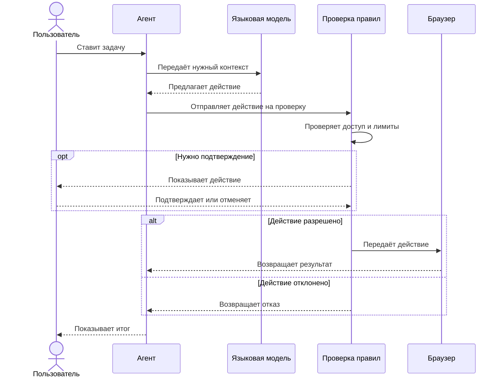

# SocialBot. Безопасный браузерный агент

`Кейс` · `Код закрыт`

[Вернуться к списку проектов](../README.md)

## Задача

В социальных сетях много повторяющейся работы. Нужно прочитать новые сообщения, подготовить ответ или выполнить другое обычное действие.

Эту работу можно поручить AI-агенту. Но нельзя давать модели полный доступ к браузеру. Она может неправильно понять задачу, выбрать не тот аккаунт или отправить текст без проверки.

Поэтому SocialBot не работает полностью самостоятельно. Модель предлагает действие, а обычный код проверяет его перед запуском.

## Как работает SocialBot

Пользователь ставит задачу через командную строку или локальный интерфейс. Агент передаёт модели только нужную информацию. Модель выбирает одно действие из короткого списка.

После этого система проверяет действие. Она смотрит, разрешено ли оно, не превышен ли лимит и нужно ли подтверждение пользователя. Только после проверки браузер выполняет команду.



## Что сделано

- Агент работает только с заранее заданными командами.
- Опасные действия требуют подтверждения.
- Для каждого аккаунта хранится отдельное состояние.
- Лимиты не дают выполнить слишком много действий подряд.
- Планировщик защищён от повторного запуска одной задачи.
- Готовые сценарии можно запускать без нового обращения к модели.
- В журнал попадает ход работы, но не попадают сообщения и секреты.

## Как выглядит безопасный сценарий

Например, пользователь просит обработать новые сообщения.

```text
Прочитать новые сообщения
Подготовить черновик ответа
Показать аккаунт, получателя и текст
Спросить подтверждение
Отправить один раз или отменить
```

Если пользователь отменяет действие или долго не отвечает, отправки не будет.

## Несколько аккаунтов

Аккаунт выбирается явно для каждой задачи. Агент не полагается на то, какой профиль случайно открыт в браузере. Это снижает риск выполнить правильное действие не в том аккаунте.

Переключение аккаунта тоже проходит проверку. Модель не может сама получить доступ к другому профилю.

## Готовые сценарии

Повторяющиеся процессы оформлены как отдельные сценарии. У каждого сценария есть понятные входные данные, разрешённые команды и условие остановки.

Если модель не нужна, сценарий выполняется обычным кодом. Так результат проще проверить, а работа стоит дешевле.

## Журнал работы

Журнал помогает понять, что запросил пользователь, какое действие предложила модель и почему система его разрешила или заблокировала.

Текст переписки, cookies, токены и другие секреты в журнал не записываются. Для поиска ошибки достаточно номера запуска, типа действия и результата проверки.

## Проверка качества

Проект проверяется на нескольких уровнях.

- Отдельно тестируются правила доступа, лимиты и подтверждения.
- Агент тестируется с подменённой моделью и подменённым браузером.
- Браузерные тесты проверяют изменения страницы и ошибки навигации.
- Полный тест проходит весь путь до запроса подтверждения на вымышленных данных.
- Автоматические проверки запускаются при изменении закрытого репозитория.

В этом кейсе нет процента покрытия и других цифр, которые нельзя проверить без доступа к закрытому репозиторию.

## Ограничения

- Интерфейс социальной сети может измениться. Тогда нужно обновить браузерный модуль.
- CAPTCHA и другие проверки безопасности проходит человек.
- Проект не предназначен для массовой рассылки и обхода правил площадки.
- Подготовленный моделью текст всё равно нужно проверить перед отправкой.
- Правила снижают риск ошибки, но не заменяют контроль владельца аккаунта.

## Что можно улучшить

Следующий шаг состоит в том, чтобы добавить больше проверок браузерного модуля и точнее разделить действия по уровню риска. Также нужна отдельная процедура на случай, если внешнее действие успело выполниться только частично.

## Почему код закрыт

Проект работает с реальными аккаунтами и внешними площадками. Поэтому исходный код, настройки браузера и рабочие данные не публикуются.

В открытом доступе нет аккаунтов, сообщений, cookies, внутренних селекторов, прокси, токенов и способов обхода ограничений площадки.
